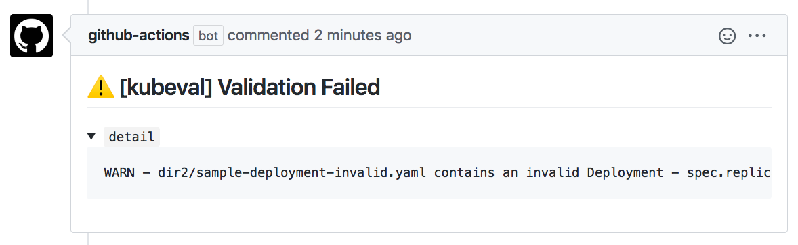

# Validate Kubernetes manifests

[](https://github.com/makocchi-git/actions-k8s-manifests-validate/actions)

Validate [Kubernetes](https://github.com/kubernetes/kubernetes) manifests in your repository.  
This action uses [Kubeval](https://kubeval.instrumenta.dev/) for validating.



## Usage

### Basic

```yaml
# .github/workflows/manifests-validation.yml
name: Pull Request Check

on: [pull_request]

jobs:
  validation:
    runs-on: ubuntu-latest
    steps:
      - uses: actions/checkout@v2
      - name: validate manifests in dir1 and dir2
        uses: makocchi-git/actions-k8s-manifests-validate@1.0.0
        with:
          files: dir1,dir2
          token: ${{ secrets.GITHUB_TOKEN }}
```

### Input parameters

| Parameter                | Description                                                      | Default  |
| ------------------------ | ---------------------------------------------------------------- | -------- |
| `files`                  | Files or directories to validate                                 | `.`      |
| `version`                | Version of Kubernetes to validate against                        | `master` |
| `strict`                 | Whether to not to check for extra properties                     | `true`   |
| `openshift`              | Whether to use the schemas from OpenShift rather than Kubernetes | `false`  |
| `ignore_missing_schemas` | Whether or not to skip custom resources                          | `true`   |
| `comment`                | Write validation details to pull request comments                | `true`   |
| `token`                  | Github token for api. This is required if `comment` is true      | `""`     |

_NOTICE_: Currently kubeval does not support to ignore specify files in the target directories.
So when you set the `files` parameter to "."(default),
your action would say "ERR  - .github/workflows/your_action.yml: Missing 'kind' key".😥
